# Aurelia

A cinematic desktop client for [Jellyfin](https://jellyfin.org), built in Rust
with [GPUI](https://gpui.rs) and [GPUI Kit](https://gpui-kit.com). Movies and TV
in an artwork-led interface; playback in [mpv](https://mpv.io), with your
progress kept in sync with the server.

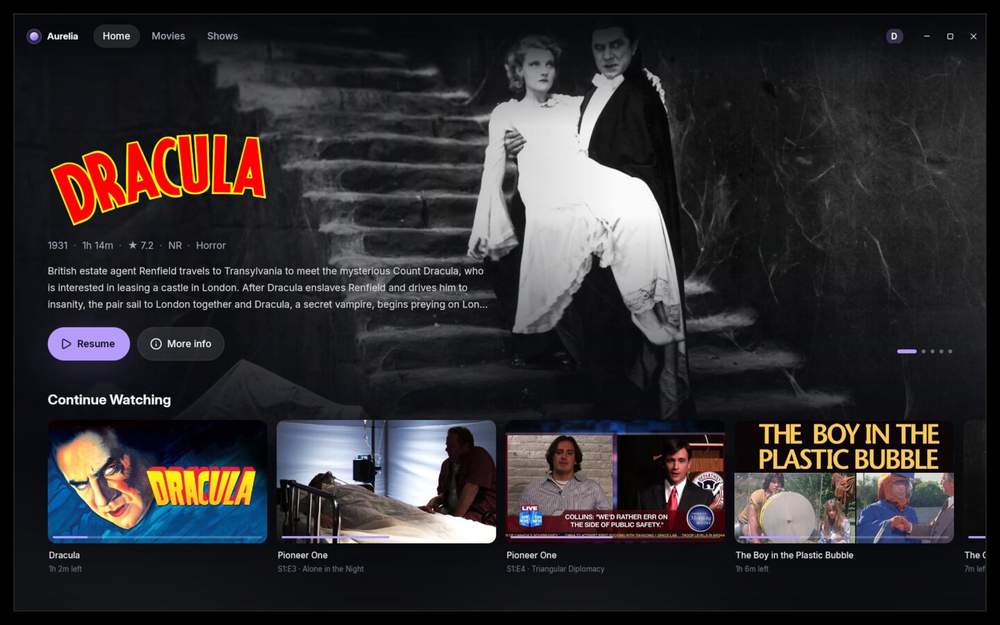

| | |
|---|---|
| 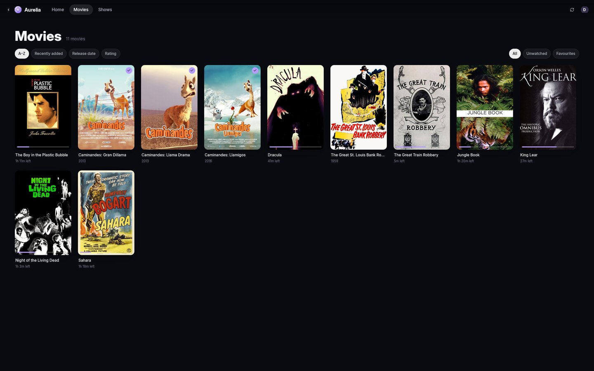 | 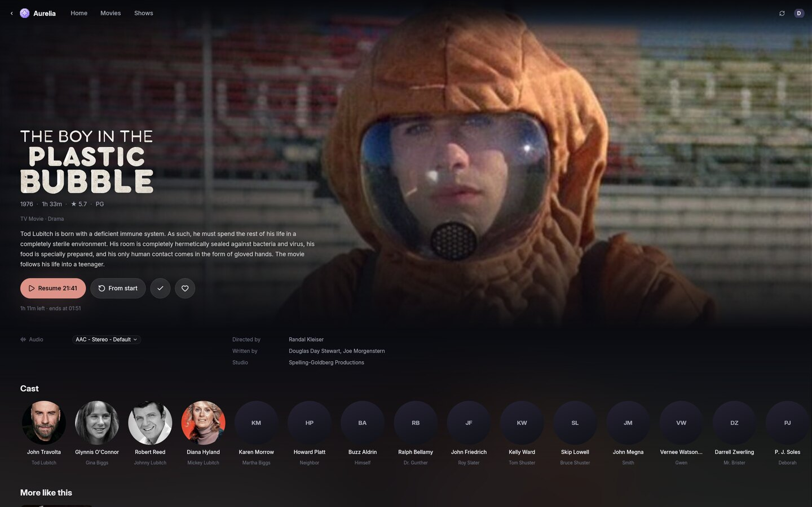 |
| 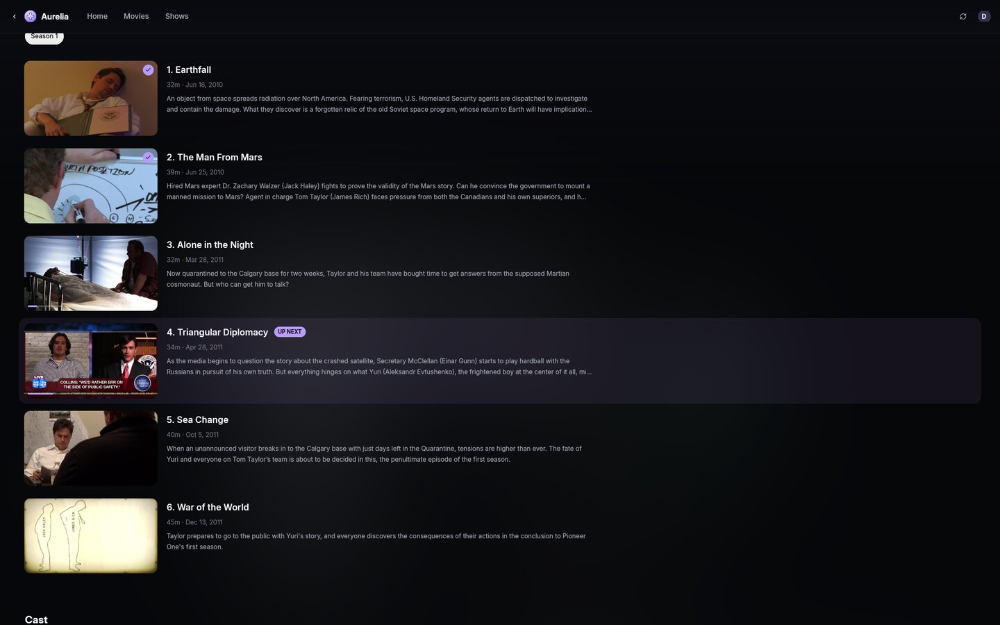 | 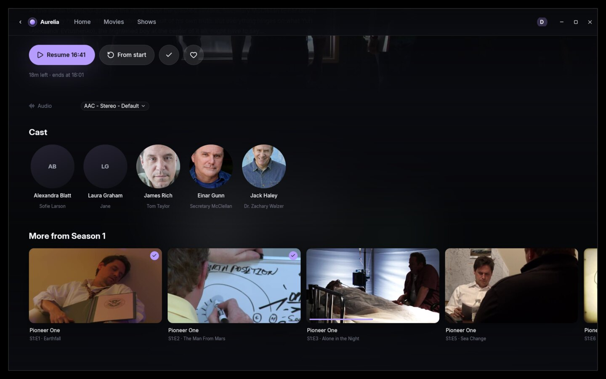 |
| 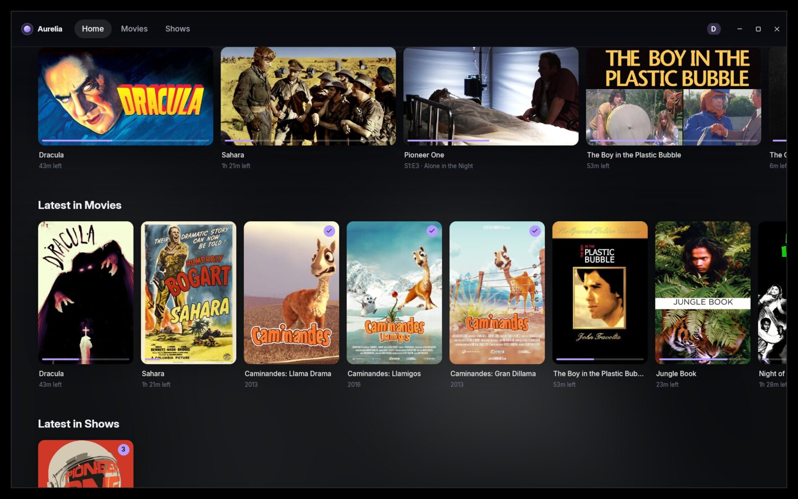 | 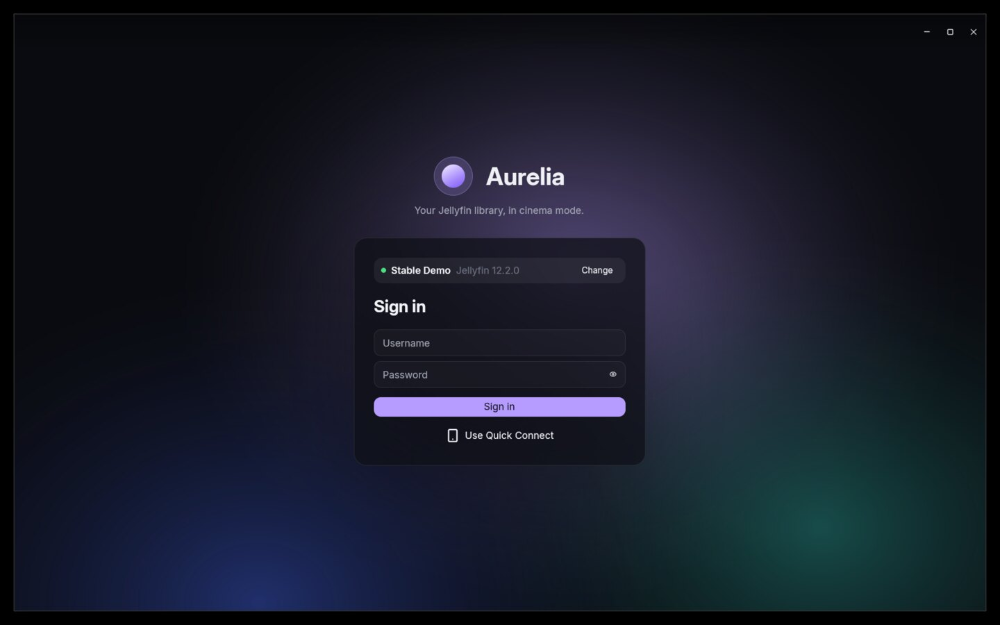 |
| 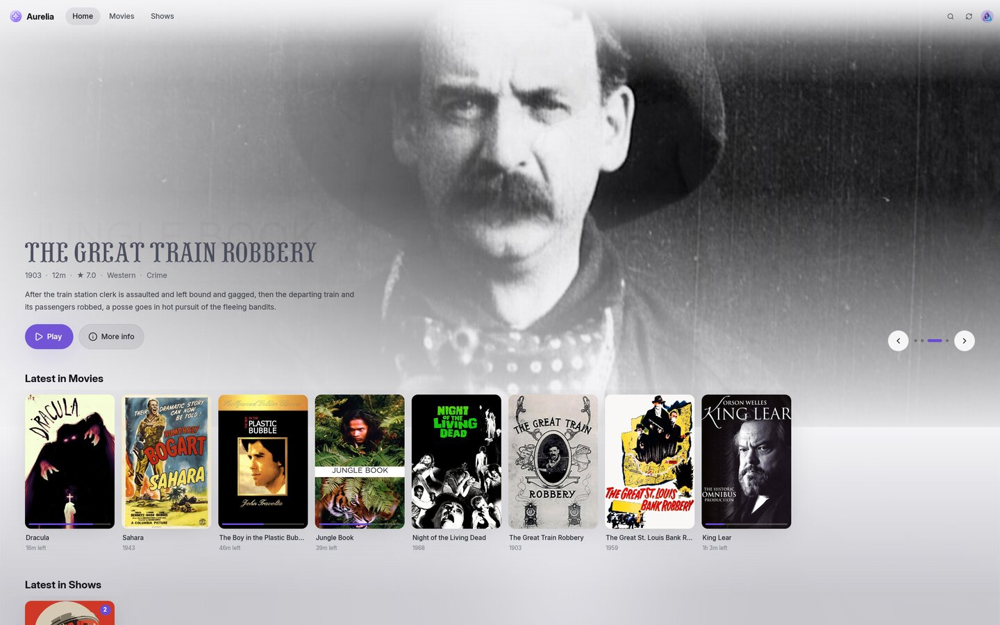 | 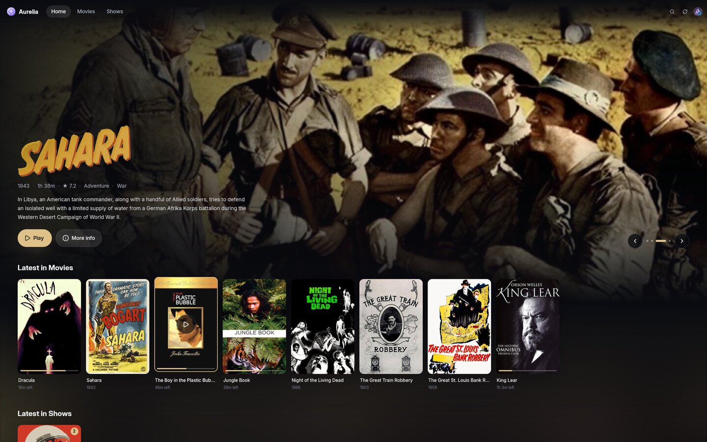 |
| 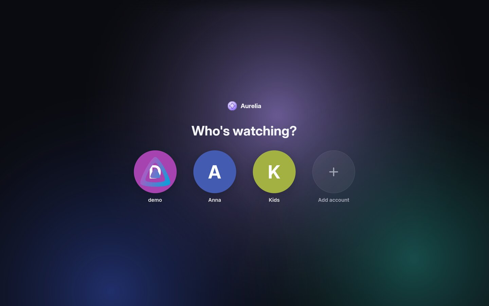 | 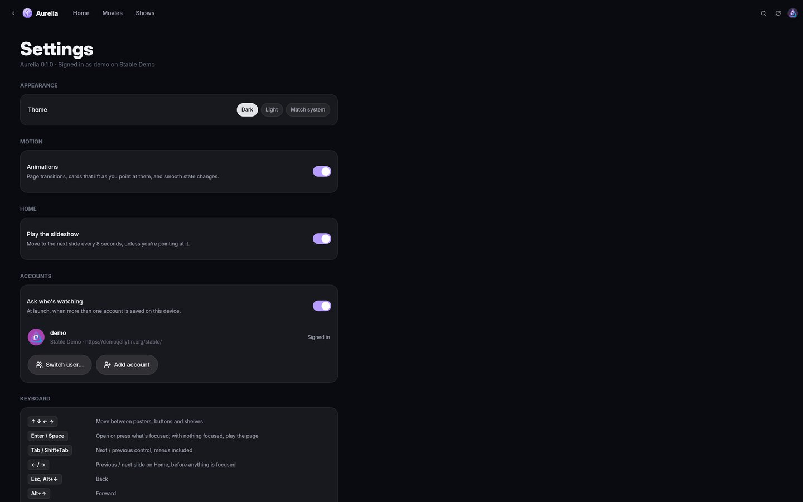 |

## Features

- **Home**: a hero slideshow of what you're watching and what's new (advances
  every 8 s, pauses while you point at it, with arrows and ←/→), then
  Continue Watching, Next Up, your Favourites and the latest additions to every
  library.
- **Libraries**: a virtualised poster grid for libraries of any size, sorted by
  name, date added, release date or rating, and filtered by genre, unwatched or
  favourites. Collections get their own tab when you have any.
- **Search**: results as you type, in shelves of movies, shows, collections,
  people and episodes. Before you type, every genre is a tile to browse.
- **People, collections and genres**: cast headshots open a person's page
  (biography and everything they're in), collections open a page with their
  titles in release order, and genres link to a grid of everything in them.
- **Right-click menus** on every poster, episode and shelf card: play or resume,
  start over, mark watched or unwatched, favourite, and jump to the show or
  season. Changes show everywhere at once.
- **Movies and episodes**: full-bleed artwork, title logos, quality badges (4K,
  HDR, Dolby Vision, Atmos), cast, and related titles. Resume or start over,
  choose audio and subtitle tracks, and mark items watched or favourite.
- **Shows**: Next Up front and centre, season tabs and an episode list. Each
  episode can be played straight from its thumbnail.
- **Playback in mpv**: starts at your resume point and reports progress, pause,
  seeks and stop to Jellyfin. Your mpv config, scripts and key bindings all
  apply. External subtitles are loaded automatically, and your access token is
  never put on the command line.
- **Accent colours**: every page takes its accent colour and soft ambient light
  from its artwork.
- **Light and dark**: a dark, cinematic theme, a fully light one (artwork fades
  into a light page and white title logos are redrawn dark), or follow the
  desktop's setting.
- **Keyboard navigation**: the arrow keys move between posters, shelves,
  buttons and filters by where they are on screen, like a TV interface. Enter
  or Space presses whatever is focused, and going back puts focus back where
  you were.
- **Motion**: cards lift as you point at them or focus them, pages fade in,
  and buttons, tabs and switches ease between states. Animations can be turned
  off in Settings.
- **Accounts and "Who's watching?"**: keep several accounts, on one server or
  several, and switch between them without signing in again. Other users your
  server lists appear too. The picker opens at launch once two or more
  accounts are saved, and from the account menu.
- **Sign-in**: username and password, or Quick Connect. Only the session tokens
  are kept (in `~/.config/aurelia`, mode 0600), never your password. Each
  account signs in as its own device.
- **Settings** (account menu or `Ctrl+,`): theme, animations, the Home
  slideshow, the launch picker, and your saved accounts.

## Running

With Nix:

```sh
nix run            # build and launch
nix build          # result/bin/aurelia, plus a .desktop entry and icon
```

For development:

```sh
nix develop
cargo run -p aurelia
cargo test --workspace                  # unit and mock-server tests
cargo test --workspace -- --ignored     # also: live demo server, real mpv
```

Aurelia needs `mpv` on `PATH`, or set `AURELIA_MPV=/path/to/mpv`.

## Keyboard

| Key | Action |
|---|---|
| `↑` `↓` `←` `→` | Move between posters, shelves and buttons |
| `Enter`, `Space` | Press what's focused; with nothing focused, play the movie, episode, show or collection on screen |
| `Tab` / `Shift+Tab` | Next / previous control, including the pickers and the account menu |
| `Ctrl+F` or the 🔍 button | Search (`Esc` clears it, then goes back) |
| `←` / `→` | Previous / next slide on Home, before anything is focused |
| `Esc`, `Alt+←`, mouse back | Back (on Home: let go of the focused item) |
| `Alt+→`, mouse forward | Forward |
| `Ctrl+R`, `F5`, or the ⟳ button | Refresh (also automatic when you come back after a couple of minutes) |
| `Ctrl+,` | Settings |
| `Ctrl+Q` | Quit |

## Architecture

```
crates/jellyfin   typed async Jellyfin API client (reqwest + serde), no UI
crates/player     Player trait + mpv backend over JSON IPC, no UI, no Jellyfin
crates/aurelia    the GPUI application
```

Network calls run on a small Tokio runtime and GPUI tasks await them. Images
are downloaded, decoded and (for ambient light) blurred off the UI thread.
They're cached in memory (LRU) and on disk in `~/.cache/aurelia`, with blurhash
placeholders while they load. The player sits behind a trait, so an embedded
(libmpv) backend can be added later.

The design spec and implementation plan are in [`docs/superpowers`](docs/superpowers).

## Development hooks

These environment variables exist for screenshots and end-to-end testing:

| Variable | Effect |
|---|---|
| `AURELIA_SERVER`, `AURELIA_USER`, `AURELIA_PASSWORD` | Sign in automatically (server alone: pre-fill and probe it) |
| `AURELIA_ROUTE=item:<id>`, `series:<id>`, `library:<id>`, `collection:<id>`, `person:<id>`, `genre:<name>`, `search:<query>`, `settings` | Open a page at startup |
| `AURELIA_KEYS="down down right enter"` | Type these keys into the window, one every 0.7 s, starting `AURELIA_KEYS_AFTER` seconds (default 8) after launch |
| `AURELIA_AUTOPLAY=1` | Play the first item page opened |
| `AURELIA_SCROLL_Y=<px>` | Scroll pages down once loaded |
| `AURELIA_LOG=debug` | Logging filter (`tracing` syntax) |

Use `XDG_CONFIG_HOME` and `XDG_CACHE_HOME` to keep a test session away from
your real one. To take screenshots without touching your desktop, run Aurelia
in a headless compositor, e.g. `WLR_BACKENDS=headless sway` with `grim`.
